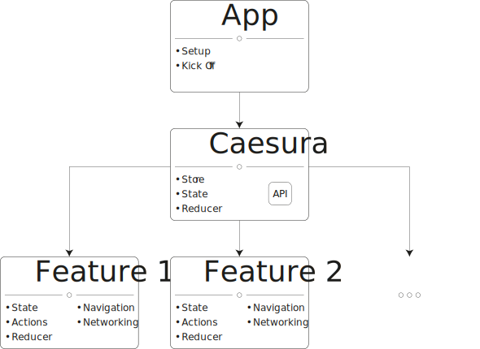
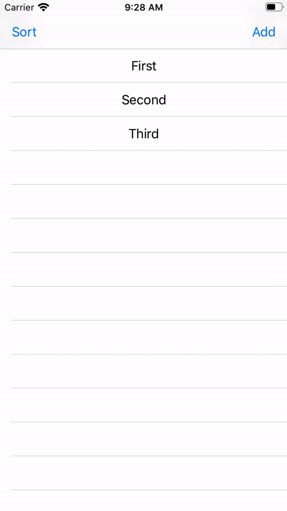

# Usage

- [Introduction](#introduction) - [Hands-on](#hands-on)
- [Manager](#manager) - [API](#api), [Middleware](#middleware), [ModuleMapper](#modulemapper), [Reducer](#reducer-1), [Registrable](#registrable)
- [Module](#module) - [StateType](#statetype), [ActionType](#actiontype), [initialState](#initialstate), [startAction](#startaction), [stopAction](#stopaction), [reducer](#reducer), [navigationActionMapper](#navigationactionmapper), [apiActionDispatcher](#apiactiondispatcher)
- [Navigation](#navigation) - [NavigationAction](#navigationaction), [UI](#ui)
- [Built-in Modules](#built-in-modules) - [Standard Action](#standard-action), [Crash Detector](#crash-detector), [Recorder](#recorder), [Reporter](#reporter), [Retriever](#retriever), [Timeline](#timeline), [Logger](#logger), [Kick Off](#kick-off), [ReRxSwift](#rerxswift)

## Introduction

First of all, let's be clear. The main purpose of `Caesura` is to provide a way that you can develop modularized features in such way that they are completely decoupled. Why would you want such thing? Plenty of reasons. Some of them are:

- Reusability. Do you need the same feature in another app? Just copy the module and it's going to work. No extra effort of digging into the app and figure out how to decouple it.
- Simplicity. You open the app and you can easily know all the features that it is composed of. If you want to know more details of any feature, you can dive deeper into it. Plus you can disable any feature at any moment by just removing a dependency and one or two lines of code (those lines should be located at the main module, aka the app).
- Abstraction. It's easy to realize what has to be public and what does not.

Let me show you a simplified diagram of the intended architecture for most of the apps.



Take into consideration that the features should not communicate between them in most of the cases. When such requirement arises, `Caesura` provides the tools to do it easily.

**I strongly recommend you to download the example project so you can see what `Caesura` is capable of.**

Here's a glimpse of what the `workspace` looks like...


### Hands-on

In order to start using `Caesura`, you just have to declare a `Manager` inside your `AppDelegate`.

```swift
@UIApplicationMain
class AppDelegate: UIResponder, UIApplicationDelegate {
    
    let caesura = Manager.main
        .register(moduleMapper: AppModuleMapper.handleAction)
        .register(module: YourFirstModule.self)
        .register(module: YourSecondModule.self)
        .start()
    
}
```

As you probably noticed, there is an `AppModuleMapper`. It should define the starting point of each module.

```swift
class AppModuleMapper {
    
    static let handleAction: ModuleStarterSingleReturn = {
        switch $0 {
        case NavigationCompletionAction.start:
            return YourFirstModule.self
        case YourFirstModule.ActionType.next:
            return YourSecondModule.self
        default: return nil
        }
    }
    
}
```

Ok, but... What is each module composed of?

## Module

A module is the public interface of a feature that has to be implemented by an app. The most complex case would be something like:

```swift
class ExampleModule: Module {
    
    typealias StateType = ExampleState
    typealias ActionType = ExampleAction
    
    static var initialState: StateType {
        return .init()
    }
    
    static var startAction: ActionType {
        return .start
    }
    
    static var stopAction: ActionType {
        return .stop
    }
    
    static var reducer: Reducer<ActionType, StateType> {
        return ExampleReducer.handleAction
    }
    
    static func navigationActionMapper() -> NavigationActionMapper<ActionType> {
        return ExampleNavigationActionMapper()
    }
    
    static func apiActionDispatcher(
        with api: API
    ) -> APIActionDispatcher<ActionType> {
        return ExampleAPIActionDispatcher(
            exampleClient: api.example
        )
    }
    
}
```

Let's dig into one by one.

### StateType

```swift
typealias StateType = ExampleState
```

Each module is responsible for only one type of state.

```swift
struct ExampleState: StateType {

    let some = "Some information that you need to store"
    let another = "Another information that you need to store"

}
```

This `struct` contains all the information needed by such module.

### ActionType

```swift
typealias ActionType = ExampleAction
```

Each module is responsible for only one type of action.

```swift
enum ExampleAction: Action {
    case start
    case fetch
    case loading
    case error(Error)
    case set(String, String)
    case stop
}
```

This `enum` contains all the actions that can be performed by such module.

#### ActionWrapper

You can declare many `structs` instead of one `enum` if you prefer. You just have to declare a `protocol` which has to be conformed by your actions.

```swift
protocol ExampleAction: Action { }

struct ExampleStartAction: ExampleAction { }

struct ExampleGenericAction<T>: ExampleAction { ... }

extension ExampleModule {

    ...

    typealias ActionType = ActionWrapper<ExampleAction>
    
    ...

}
```

### initialState

```swift
static var initialState: StateType {
    return .init()
}
```

This is the state sent to the [reducer](#reducer) in case that it's not defined yet.

### startAction

```swift
static var startAction: ActionType {
    return .start
}
```

This action is the one that is going to be dispatched by a [ModuleMapper](#modulemapper) in order to start such module.

### stopAction

```swift
static var stopAction: ActionType {
    return .stop
}
```

It's the same than the [startAction](#startaction) but with the purpose of stopping the module. It's not called when the module has finished doing what it is supposed to do. It's called when it has to be stopped because of an external reason (defined by you).

Most of the modules don't need it, so it can definitely be skipped in such case.

### reducer

```swift
static var reducer: Reducer<ActionType, StateType> {
    return ExampleReducer.handleAction
}
```

Not much to explain here. As you already know, It's the business logic of the module. The only thing to mention is that the reducer receives the [initialState](#initialstate) if it's not defined. And, it's only going to receive the actions of type [ActionType](#actiontype). You don't have to unbox the `state` and cast the `action` anymore.

```swift
struct Reducer {
    
    static let handleAction: Reducer<ExampleAction, ExampleState> = { action, state in
        switch action {
        case .loading, .error: 
            // Do whatever you need to do here...
            break
        case .set(let some, let another): 
            return .init(
                some: some, 
                another: another
            )
        default: print("Action not handled -> \(action)")
        }
    }
    
}
```

### navigationActionMapper

```swift
static func navigationActionMapper() -> NavigationActionMapper<ActionType> {
    return ExampleNavigationActionMapper()
}
```

This is the responsible for mapping the actions into navigation actions.

```swift
class ExampleNavigationActionMapper: NavigationActionMapper<ExampleAction> {
    
    override func map(
        _ action: ActionType
    ) -> ActionReturnType? {
        switch action {
        case .start:
            return .set(
                NavigationController(
                    rootViewController: ExampleViewController()
                )
            )
        default: return nil
        }
    }
    
}
```

So, basically, this means that when the [startAction](#startaction) is received, it's going to be transformed into a `NavigationAction.set`, which is going to set the `rootViewController` of the visible `window` to the specified one.

Check out the [NavigationAction](#navigationaction) to see all the possible actions.

### apiActionDispatcher

```swift
static func apiActionDispatcher(
    with api: API
) -> APIActionDispatcher<ActionType> {
    return ExampleAPIActionDispatcher(
        exampleClient: api.example
    )
}
```

Do you need to interact with an external `API`? You have two options:

- Using [thunks](https://github.com/ReSwift/ReSwift-Thunk), provided by [ReSwift](https://github.com/ReSwift/ReSwift).
- Using the built-in option provided by `Caesura`.

Why would I choose the second option over the first one? First of all, it's more friendly with `Caesura` ecosystem (you can take advantage of all the optional modules). Second, but not less, it's way more testable because it's easier to inject dependencies.

Still not convinced? Let me show you how simple it is to use.

```swift
class ExampleAPIActionDispatcher: APIActionDispatcher<ExampleAction> {
    
    let exampleClient: ExampleClient
    
    init(
        exampleClient: ExampleClient
    ) {
        self.exampleClient = exampleClient
    }
    
    override func dispatch(
        _ action: ActionType,
        to destination: @escaping Destination
    ) -> Bool {
        switch action {
        case .fetch: handleFetch(with: destination)
        default: return super.dispatch(action, to: destination)
        }
        return true
    }
    
}

private extension ExampleAPIActionDispatcher {

    func handleFetch(
        with destination: @escaping Destination
    ) {
        handle(
            request: exampleClient.readAll,
            loading: ActionType.loading,
            success: ActionType.set,
            failure: ActionType.error,
            destination: destination
        )
    }

}
```

## Navigation

Basically, there is a list of actions that are mapped directly to methods provided by the [UIKit](https://developer.apple.com/documentation/uikit). After the operation has been completed, a completion action is dispatched.

### NavigationAction

```swift
NavigationAction.set -> NavigationCompletionAction.set
NavigationAction.present -> ... -> NavigationCompletionAction.present
NavigationAction.dismiss -> ... -> [NavigationCompletionAction.dismiss]
NavigationAction.dismissToViewController -> ... -> [NavigationCompletionAction.dismiss]
NavigationAction.dismissToRootViewController -> ... -> [NavigationCompletionAction.dismiss]

NavigationAction.setNavigation -> ... -> NavigationCompletionAction.setNavigation
NavigationAction.push -> ... -> NavigationCompletionAction.push
NavigationAction.pop -> ... -> NavigationCompletionAction.pop
NavigationAction.popToViewController -> ... -> NavigationCompletionAction.setNavigation
NavigationAction.popToRootViewController -> ... -> NavigationCompletionAction.setNavigation

NavigationAction.setTabs -> NavigationCompletionAction.setTabs
NavigationAction.insertTab -> NavigationCompletionAction.insertTab
NavigationAction.removeTab -> NavigationCompletionAction.removeTab
NavigationAction.selectTab -> NavigationCompletionAction.selectTab
```

### UI

In order to be able to use most of the optional [built-in modules](#built-in-modules), you should use the provided `UI` classes (`ViewController`, `NavigationController`, `TabBarController`). 

If you decide not to use them, you should take responsibility for dispatching all the `NavigationCompletionAction` when needed. Otherwise, as warned before, some optional [built-in modules](#built-in-modules) would not work properly.

## Manager

In order to use [ReSwift](https://github.com/ReSwift/ReSwift), you have to declare a `state`, a `reducer` and a `store`. The three of them are encapsulated by the `Manager`:

- The `state` stores all the registered states. 
- The `reducer` updates such states with the registered reducers.
- The `store` perfoms the same tasks as [ReSwift](https://github.com/ReSwift/ReSwift)'s `store`.

### Initialization

```swift
let caesura = Manager.main
    .register(
        api: API()
    )
    .register(
        middlewares: .debug(),
        priority: .high
    )
    .register(
        actionRegistrable: StandardActionStore.default
    )
    .register(
        reducer: TimelineReducer.handleAction
    )
    .register(
        moduleMapper: AppModuleMapper.handleAction
    )
    .register(
        module: SomeModule.self
    )
    .start()
```

### API

```swift
Manager.main.register(
    api: API()
)
```

As mentioned before, you can interact with an external `API` using `Caesura`. To inject such object into your [apiActionDispatchers](#apiactiondispatcher), you have to register it first.

### Middleware

```swift
Manager.main.register(
    middlewares: .debug(),
    priority: .high
)
```

You probably used them before with [ReSwift](https://github.com/ReSwift/ReSwift). It's exactly the same, so no extra explanation needed here. The only thing to mention is that, to make them simpler to use, it was wrapped into two protocols: `Middleware` and `DebugMiddleware`. The middlewares that conform to the second `protocol` are only registered when the build configuration is set to `Debug`.

```swift
class LoggerMiddleware: Middleware {
    
    func intercept(
        dispatch: @escaping DispatchFunction,
        state: @escaping () -> State?
    ) -> MiddlewareReturnType {
        return { next in
            return { action in
                print(action)
            }
        }
    }
    
}
```

 In case that you prefer using them as `functions`, you can do it.
 
 ```swift
 func createLoggerMiddleware() -> ReSwift.Middleware<State> {
    return { dispatch, getState in
        return { next in
            return { action in
                print(action)
            }
        }
    }
}
 ```

#### Priority

The priority that is used to register a middleware defines where it is located inside the queue of middlewares. There are three types of priority:

```swift
enum MiddlewarePriority {
    case high
    case medium
    case low
}
```

### ModuleMapper

```swift
Manager.main.register(
    moduleMapper: AppModuleMapper.handleAction
)
```

As shown [before](#hands-on), a module mapper is intended to start the different modules. Also, it can be used to stop a module if needed.

```swift
class AppModuleMapper {
    
    static let handleAction: ModuleMapperSingleReturn = {
        switch $0 {
        case NavigationCompletionAction.start:
            return .start(YourFirstModule.self)
        case YourFirstModule.ActionType.next:
            return .start(YourSecondModule.self)
        case YourFirstModule.ActionType.some:
            return .stop(YourSecondModule.self)
        default: return nil
        }
    }
    
}
```

Something important to mention is that you can register as many `ModuleMappers` as you want. Do you have a module with many submodules? You can delegate the mapping to such module.

```swift
class AppModuleMapper {
    
    static let handleAction: ModuleMapperSingleReturn = {
        switch $0 {
        case NavigationCompletionAction.start:
            return .start(YourFirstModule.self)
        case YourFirstModule.ActionType.next:
            return .start(YourSecondModule.self)
        default: return nil
        }
    }
    
}

extension YourSecondModule {

    static let moduleMapper: ModuleMapper = {
        switch $0 {
        case YourSecondModule.ActionType.start:
            return [
                .start(YourSecondModule.self),
                .start(YourThirdModule.self)
            ]
        case YourThirdModule.ActionType.add:
            return [
                .start(YourFourthModule.self)
            ]
        case YourThirdModule.ActionType.remove:
            return [
                .stop(YourFourthModule.self)
            ]
        default: return nil
        }
    }

}
```

The `ModuleMappers` are treated as a binary tree. Therefore, you can go as deep with submodules as you want.

### Reducer

```swift
Manager.main.register(
    reducer: TimelineReducer.handleAction
)
```

Registering reducers directly should not be common at all. It's intended to be used in particular cases. One of those cases is the [Timeline](#timeline). To go back and forth in time, it needs to set the entire state to one that was saved by itself.

```swift
class TimelineReducer {
    
    static let handleAction: Reducer<TimelineAction, State.Store> = { action, state in
        switch action {
        case .setState(let state): return state
        default: return state
        }
    }
    
}
```

As you probably noticed, it receives the entire `state`. It's a `Dictionary<String, StateType>`.

### Registrable

Every time that a new module is registered, the registrables are called. Therefore, to assure correct functioning, they should be registered before the modules. 

#### ActionRegistrable

```swift
Manager.main.register(
    actionRegistrable: StandardActionStore.default
)
```

This means that every time that a module is registered, the method `registrable.register(action:)` is called.

#### StateRegistrable

```swift
Manager.main.register(
    stateRegistrable: SomeStateRegistrable()
)
```

This means that every time that a module is registered, the method `registrable.register(state:)` is called.

## Built-in Modules

### Standard Action

This module is responsible for:

- Serializing `actions` into a `JSON`.
- Serializing a `JSON` into `actions`.
- Storing the `JSON`s in files (using the [FileManager](https://developer.apple.com/documentation/foundation/filemanager)).

It is not possible to serialize an `Action` directly into a `JSON`. That's why the `StandardAction` exists.

```swift
StandardAction(
    name: "SomeIdentifier",
    payload: AnyEncodable()
)
```

#### StandardActionConvertible

In order to convert your `actions` into `StandardAction`s and vice versa, they have to conform to `StandardActionConvertible`.

```swift
enum SomeAction: Action {
    case start
    case set(String)
}

extension SomeAction: StandardActionConvertible {
    
    init(
        action: StandardAction
    ) throws {
        guard let key = CodingKeys(rawValue: action.name)
            else { throw StandardActionError.keyNotFound }
        switch key {
        case .start: self = .start
        case .set: try self = .set(action.decodedPayload())
        }
    }
    
    public func toStandard() -> StandardAction? {
        switch self {
        case .start: return StandardAction(name: name)
        case .set(let value): return StandardAction(name: name, payload: value)
        }
    }
    
}

private extension SomeAction {
    
    enum CodingKeys: String {
        case start
        case set
    }
    
    var key: CodingKeys {
        switch self {
        case .start: return .start
        case .set: return .set
        }
    }
    
    var name: String {
        return key.rawValue
    }
    
}
```

#### ActionWrapper

As mentioned [before](#actionwrapper), you can use many `structs` instead of one `enum`. It can be a little bit trickier to conform `StandardActionConvertible` with your `ActionWrapper`.

```swift
class SomeAction: ActionWrapper<SomeActionProtocol>, StandardActionConvertible {
    
    static let allTypes: [StandardActionConvertible.Type] = [
        SomeStartAction.self,
        ChangeValueAction<Int>.self,
        ChangeValueAction<String>.self,
        ChangeValueAction<Bool>.self
    ]
    
    required init(
        action: StandardAction
    ) throws {
        guard let convertedAction = Self.allTypes
            .compactMap({ try? $0.init(action: action) })
            .first as? SomeActionProtocol
            else {
                throw SomeError()
            }
        super.init(convertedAction)
    }
    
    func toStandard() -> StandardAction? {
        return (unwrap() as? StandardActionConvertible)?.toStandard()
    }
    
}
```

As you can see, if you want to use generic actions, you have to take care of all the possible cases in order to convert a [StandardAction](#standard-action) into a `SomeAction`.

### Crash Detector

```swift
Manager.main.register(
    middleware: CrashDetectorMiddleware()
)
```

When the app is about to crash, a `CrashDetectorCompletionAction.willCrash` is dispatched. That's the moment to save whatever you need to save.

After starting the app, if a crash occurred during the last session, a `CrashDetectorCompletionAction.didCrash` is dispatched. That's the moment to show an alert to the user saying `Sorry, I'll fix it soon :)`.

### Recorder

**Depends on:** [Standard Action](#standard-action), [ViewControllers](#ui).

```swift
Manager.main.register(
    middleware: RecorderMiddleware()
)
```

Once the app is terminated (due to a crash or not), all the actions that have been dispatched to the store are saved on a [store](#standard-action). For them to be saved, they have to conform the [StandardActionConvertible](#standardactionconvertible) `protocol`.

### Reporter

**Depends on:** [Crash Detector](#crash-detector), [Recorder](#recorder).

```swift
Manager.main.register(
    middleware: ReporterMiddleware { sessions in
        print(sessions)
    }
)
```

Once a crash is detected by the [Crash Detector](#crash-detector), this middleware tries to recover all the sessions stored by the [Recorder](#recorder) and calls the `outputHandler` with them. You can do whatever you want with such information. I strongly recommend you to share it with your `API`.

Take into consideration that you receive an `Array` of `Data`. Each element is related to a session. The last one is the one that triggered the [Crash Detector](#crash-detector).

### Logger

```swift
Manager.main.register(
    middleware: LoggerMiddleware()
)
```

It simply prints every action. You can subclass it and override the `log(action:)` method.

### Kick Off

```swift
Manager.main.register(
    middleware: KickOffMiddleware()
)
```

This middleware doesn't do anything by itself. You have to subclass it and override the `kickOff()` method. It's intended to be used to kick off your dependencies once the app finished launching.

### Debug

```swift
Manager.main.register(
    middlewares: .debug(),
    priority: .high
)
```

In case that you decide to register any of the following modules, they are only registered when the build configuration is set to `Debug`. You don't have to worry about it.

### Blockers

```swift
Manager.main.register(
    middlewares: .blockers(),
    priority: .high
)
```

Utilities intended to be consumed by other modules. Capable of stoping the `API`, stoping animations, blacklisting actions, and more.

### Retriever

**Depends on:** [Blockers](#blockers), [Standard Action](#standard-action), [ViewControllers](#ui).

```swift
Manager.main
    .register(
        middlewares: .retriever(),
        priority: .high
    )
    .register(
        actionRegistrable: StandardActionStore.default
    )
```

Do you want to inject a session? You only have to add a `recording.json` file to your `project`. It works smoothly with the sessions provided by the [Reporter](#reporter).

The file should look like:

```json
[
    {
        "key": "Caesura.ApplicationCompletionAction",
        "name": "didFinishLaunching"
    },
    {
        "key": "Caesura.ApplicationCompletionAction",
        "name": "didBecomeActive"
    },
    {
        "key": "YourFirstModule.Action",
        "name": "start"
    },
    {
        "key": "YourSecondModule.Action",
        "name": "start"
    },
    {
        "key": "YourThirdModule.Action",
        "name": "start"
    }
]
```

### Timeline

**Depends on:** [Blockers](#blockers), [ViewControllers](#ui).

```swift
Manager.main
    .register(
        middlewares: .timeline(),
        priority: .high
    )
    .register(
        reducer: TimelineReducer.handleAction
    )
```

Do you want your app to go back and forth in time? Alright, you only have to register this module. You can activate/deactivate it at any moment by swiping up/down.



### ReRxSwift

This section is not intended to explain how [ReRxSwift](https://github.com/svdo/ReRxSwift) works. I strongly encourage you to take a look at [the repository](https://github.com/svdo/ReRxSwift) to learn more about it.

Instead, I want to share with you some extensions that can help you create `connections` with `Caesura`:

```swift
lazy var connection = Connection.toModule(
    YourFirstModule.self,
    mapStateToProps: mapStateToProps,
    mapDispatchToEvents: { ... }
)

func mapStateToProps(
    _ state: YourFirstModule.StateType
) -> Props { ... }
```

```swift
lazy var connection = Connection.toModules(
    YourFirstModule.self,
    YourSecondModule.self,
    mapStateToProps: mapStateToProps,
    mapDispatchToEvents: { ... }
)

func mapStateToProps(
    _ state: DoubleStateContainer<YourFirstModule.StateType, YourSecondModule.StateType>
) -> Props { ... }
```

There is a `TripleStateContainer` too. Since [Variadic Generics](https://forums.swift.org/t/variadic-generics/20320) are not available in [Swift](https://swift.org/) yet, you will have to code your own extension if you need a `QuadrupleStateContainer` or so. You can take a look at the source code and see how easy it is to do.
