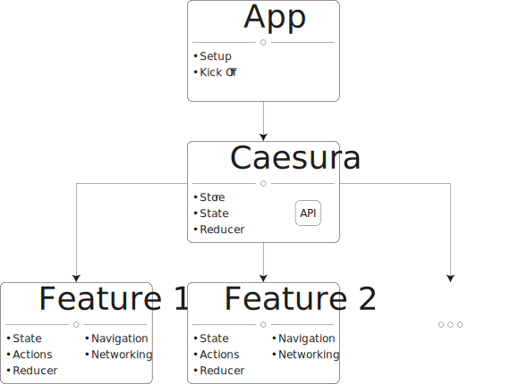

<p align="center">
    <a href="https://travis-ci.org/LucianoPolit/Caesura">
        
    </a>
    <a href="https://codecov.io/gh/LucianoPolit/Caesura">
        
    </a>
    <a href="https://swift.org/package-manager">
        
    </a>
    <a href="https://cocoapods.org/pods/Caesura">
        
    </a>
    <a href="https://gitter.im/CaesuraSwift/community">
        
    </a>
</p>

## Index

- [Features](#features)
- [Requirements](#requirements)
- [Installation](#installation)
- [Usage](./Documentation/Usage.md)
    - [Introduction](./Documentation/Usage.md#introduction)
    - [Manager](./Documentation/Usage.md#manager)
    - [Module](./Documentation/Usage.md#module)
    - [Navigation](./Documentation/Usage.md#navigation)
    - [Built-in Modules](./Documentation/Usage.md#built-in-modules)
- [Communication](#communication)
- [Author](#author)
- [License](#license)

## Features

<details>
<summary>Unidirectional Data Flow</summary>

Inherited from [ReSwift](https://github.com/ReSwift/ReSwift).

>ReSwift is a [Redux](https://github.com/reactjs/redux)-like implementation of the unidirectional data flow architecture in Swift. ReSwift helps you to separate three important concerns of your app's components:
>
>- **State**: in a ReSwift app the entire app state is explicitly stored in a data structure. This helps avoid complicated state management code, enables better debugging and has many, many more benefits...
>- **Views**: in a ReSwift app your views update when your state changes. Your views become simple visualizations of the current app state.
>- **State Changes**: in a ReSwift app you can only perform state changes through actions. Actions are small pieces of data that describe a state change. By drastically limiting the way state can be mutated, your app becomes easier to understand and it gets easier to work with many collaborators.

Go to [the repository](https://github.com/ReSwift/ReSwift) for more information.

</details>

<details>
<summary>Modularization</summary>

In order to use [ReSwift](https://github.com/ReSwift/ReSwift), you have to declare a state, a reducer and a store. Then, in most of the cases, the state ends up being spread all around the app, meaning that it's hard to keep the modules as decoupled as you probably want.

That's when `Caesura` comes in handy. It encapsulates the state, reducer and store in such way that your only concern is to develop the modules, without them depending on each other. All of that without loosing the capability to stop the app at any moment and get to know the state of the entire app.

So, a simple app would look like:



Check out the [usage documentation](./Documentation/Usage.md#module) for more information.

</details>

<details>
<summary>Navigation Router</summary>

There is a built-in module based on actions that is as flexible as [UIKit](https://developer.apple.com/documentation/uikit) is. 

Check out the [usage documentation](./Documentation/Usage.md#navigation) for more information.

</details>

<details>
<summary>Time Travel</summary>

Have you ever dreamed about traveling back and forth in time? Well, it's not possible yet. But your app can easily do it with an optional built-in module. 

Check out the [usage documentation](./Documentation/Usage.md#timeline) for more information.

</details>

<details>
<summary>Crash Tracking</summary>

An optional built-in module is capable of detecting crashes and reporting them. Each report contains all the actions dispatched to the store. Therefore, you can replay the exactly same session and discover the reason of such event easily.

Check out the [usage documentation](./Documentation/Usage.md#crash-detector) for more information.

</details>

<details>
<summary>Session Injection</summary>

The last feature wasn't complete without a way of injecting such report without having to do it manually. There is another optional built-in module capable of such thing.

Check out the [usage documentation](./Documentation/Usage.md#retriever) for more information.

</details>

<details>
<summary>ReRxSwift Integration</summary>

There is also an optional built-in module to bring the benefits of [ReRxSwift](https://github.com/svdo/ReRxSwift) into `Caesura`.

>Similar to [react-redux](http://redux.js.org/docs/basics/UsageWithReact.html), ReRxSwift allows you to create view controllers that have `props` and `actions`. View controllers read all data they need from their `props` (instead of directly from the state), and they change data by invoking callbacks defined by `actions` (instead of directly dispatching ReSwift actions). This has some nice advantages:
>
>- Better separation of concerns. It is easier to understand what your view controller does and what data it uses. In other words, it facilitates local reasoning.
>- Unit-testing. Because of the separation of concerns, you can easily unit-test your view controllers, all the way up to the Interface Builder connections.
>- Better reusability. Reusing your view controllers is as simple as specifying different mappings from state to `props` and from ReSwift actions to `actions`.
>- Rapid prototyping. You can easily use dummy `props` and `actions` so that you get a working UI layer prototype. Without writing any of your application's business logic, you can implement your presentation layer in such a way that it is very simple to replace the dummies with real state and actions.

Check out the [usage documentation](./Documentation/Usage.md#rerxswift) for more information.

</details>

## Requirements

- Xcode 10.0+
- Swift 5.0+

## Installation

### Swift Package Manager

To integrate `Caesura` into your project using [Swift Package Manager](https://swift.org/package-manager), specify it in your `Package.swift`:
```swift
// swift-tools-version:5.0

import PackageDescription

let package = Package(
    name: "YourPackageName",
    dependencies: [
        .package(
            url: "https://github.com/LucianoPolit/Caesura.git",
            .upToNextMajor(from: "1.0.0")
        )
    ],
    targets: [
        .target(
            name: "YourTarget",
            dependencies: [
                "Caesura",
                "CaesuraUI",
                "CaesuraStandardAction",
                "CaesuraMiddlewares",
                "ReRxCaesura"
            ]
        )
    ]
)
```

### CocoaPods

To integrate `Caesura` into your project using [CocoaPods](http://cocoapods.org), specify it in your `Podfile`:

```ruby
pod 'Caesura', '~> 1.0.0'
pod 'Caesura/Core'
pod 'Caesura/UI'
pod 'Caesura/StandardAction'
pod 'Caesura/Middlewares'
pod 'Caesura/ReRxSwift'
```

## Communication

- If you **need help**, [chat with the community](https://gitter.im/CaesuraSwift/community).
- If you **found a bug**, [open an issue](https://github.com/LucianoPolit/Caesura/issues/new).
- If you **have a feature request**, [open an issue](https://github.com/LucianoPolit/Caesura/issues/new).
- If you **want to contribute**, submit a pull request.

## Author

Luciano Polit | lucianopolit@gmail.com

## License

`Caesura` is available under the MIT license. See the [LICENSE](./LICENSE) file for more info.
